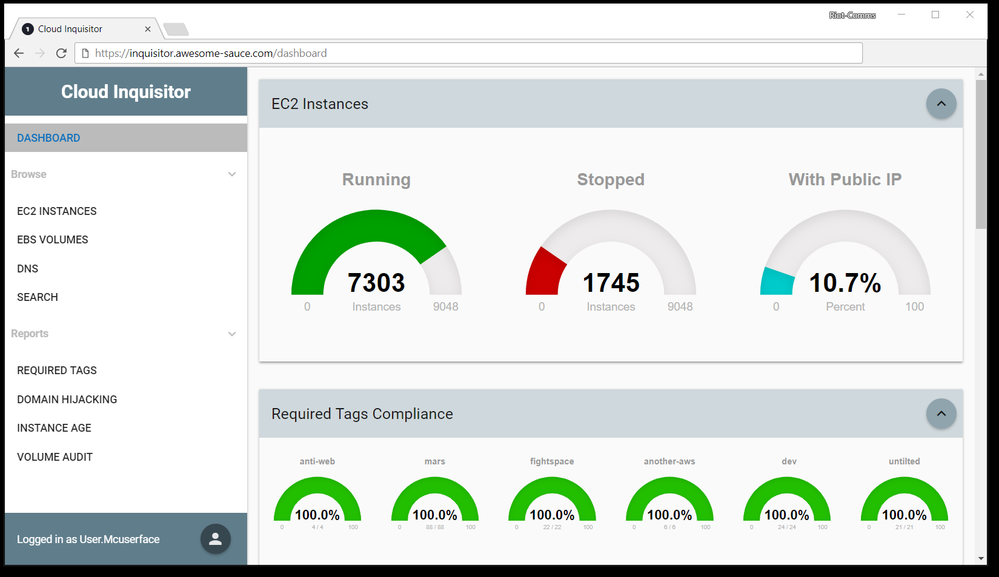
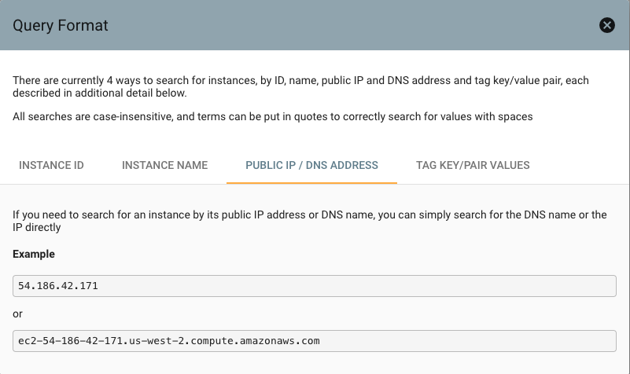
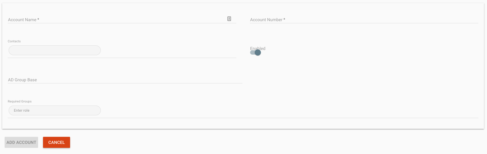
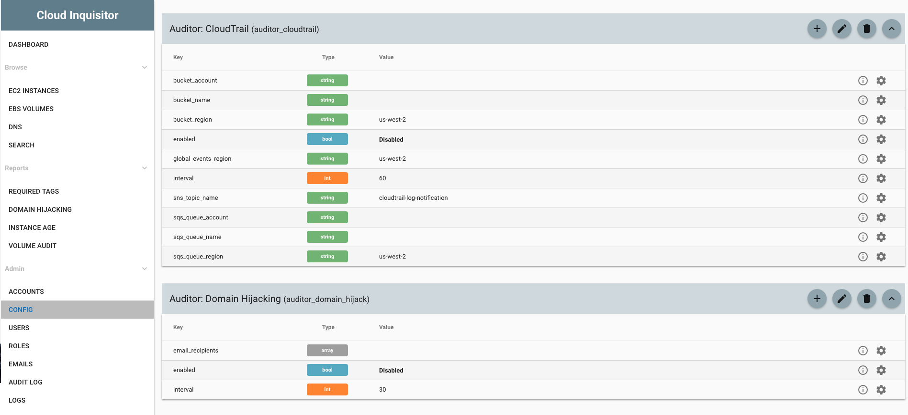

**********
User Guide
**********

This document is intended to be a user guide to inform on how to use the 
Cloud Inquisitor UI.

=========
Dashboard
=========

By default, the front-end dasbhoard shows:

* EC2 Instances that are running or stopped and which instances have a public IP.
* Percentage of ``required tags`` compliance per account.

Below is a sample screenshot showing what the dashboard looks like:

======
Browse
======

On the left-hand side of the UI, you are able to directly examine raw data:

* EC2 Instances - shows all the EC2 Instance data that Cloud Inquisitor possess, 
which should represent all EBS volumes in use in your AWS infrastructure
* EBS Volumes - shows all the EBS Volume data that Cloud Inquisitor possess, which 
should represent all EBS volumes in use in your AWS infrastructure
* DNS - shows all the dns data that Cloud Inquisitor possess (shown below, first 
screenshot)
* Search - this gives you the ability to search for instances across the Cloud 
Inquisitor database. The ``search`` page has help functionality within the page
as shown below (second screenshot)

.. image:: images/cinq_dns_collector.png

=========
Admin
=========

On the left-hand side, there are a bunch of admin options such as :

* Accounts
* Config
* Users
* Roles
* Emails
* Audit Log
* Logs

In the ``Accounts`` section, you can review the current accounts that ``Cloud Inquisitor`` is 
auditing and modify accordingly. For example, to add a new account, select the dialog button 
in the very bottom right hand side of the screen and select the "+" as shown below:

.. image:: images/cinq_account_add.png

and then you can create your new account on the following screen:

The ``Config`` section is quite detailed and this is where you can perform extensive configuration on:

* API 
* Authentication (Local/SAML)
* Auditors
* Collectors
* Logging
* Notifications (Email/Slack)
* Schedulers

Below is a sample screenshot showing what the config capabilities look like:

